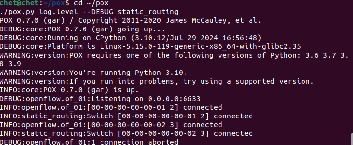
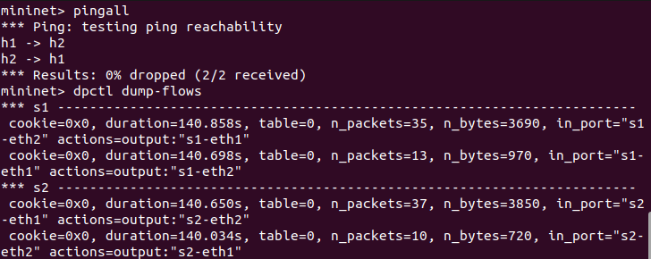
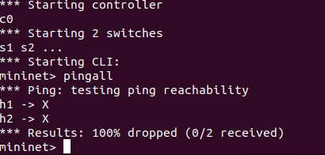

# SDN Static Routing using POX and Mininet
## Problem Statement
This project implements static routing in a Software Defined Networking (SDN) environment using a POX controller and Mininet. The controller installs flow rules manually to control packet forwarding behavior.
---
## Tools Used
* Mininet
* POX Controller
* OpenFlow Protocol
* iperf
* ping
---
## 🌐 Network Topology
h1 --- s1 --- s2 --- h2
---
## ⚙️ Setup Instructions
1. Install Mininet:
   sudo apt install mininet -y
2. Clone POX:
   git clone https://github.com/noxrepo/pox.git
   cd pox
3. Run Controller:
   ./pox.py static_routing
4. Run Mininet:
   sudo mn --custom topology.py --topo static --controller=remote
---
## 🚀 Execution Steps
* Start the POX controller
* Start Mininet
* Run pingall
* Check flow table using dpctl dump-flows
* Run iperf for throughput
---
## 📊 Results
### Scenario 1: Normal Routing
* pingall shows 0% packet loss
### Scenario 2: Blocked Traffic
* pingall shows 100% packet loss
---
## 📸 Screenshots
### Screenshot 1: Mininet Setup

### Screenshot 2: POX Controller

### Screenshot 3: Connectivity and Flow table 

### Screenshot 5: Performance

### Screenshot 6: Normal Scenario

### Screenshot 7: Blocked Scenario

---
## 📈 Performance Analysis
Latency is measured using ping and throughput using iperf.
---
## ✅ Conclusion
This project demonstrates how SDN controllers manage network behavior using static flow rules.
---
## 📚 References
* Mininet Documentation
* POX Documentation

